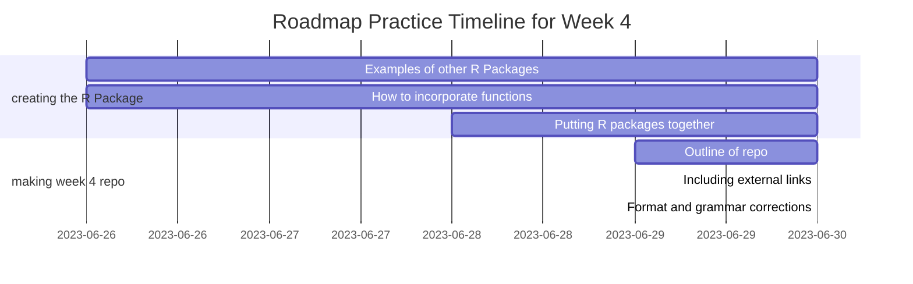

# Week 4 R Package: Making an R Package

[](https://twitter.com/csulb/with_replies)

Week 4: Making an R Package Using Week 2 Functions
1. Contact
2. Contributing
3. What is an R Package?
4. Key Points of an R Package
5. My R Package
6. Installation
7. Roadmap
8. Helpful Resources

# Contact
If you want to connect with me, [email here](mailto:hannah@mooreplasticresearch.org)

# Contributing
Contributions of all kinds are greatly appreciated!
Contact [here](mailto:hannah@mooreplasticresearch.org) on how to get started

Remember to adhere to this project's [Code of Conduct](https://github.com/Cambalab/fake-data-generator/blob/master/.github/CODE_OF_CONDUCT.md)

# What is an R Package?
An R package is a collection of functions, data, and documentation that acts like a toolkit for users to perform tasks in R studio. They are created by developers and shared with the R community.

# Key points of an R Package
1. Functionality: Each package typically focuses on a specific area of analysis
2. Installation: Need to install an R package to use it
3. Loading a package: Need to load an R package once it is installed
4. Function usage: After loading a package, you can use its functions to perform specific tasks
5. Documentation: R packages come with documentation that explains how to use their functions and provide examples
6. Community and updates: R packages are created and maintained by a community of developers and are often updated to fix bugs, add new features, etc.

# My R Package
Created three R packages incorporating functions that I created during the Week 2 training.

### R Package 1: Calculate Average Wavenumber Package
Allows users to input their data, which then calculates the overall average wavenumber of their data set
```
data(raman_hdpe, package = "OpenSpecy")

#' Calculate Average Wavenumber
#'
#' @param raman_hdpe Raman spectra data; feel free to upload your own instead
#'
#' @return Average wavenumber of entire data
#' @export
#'
#' @examples
#' calculate_average_wavenumber <- function(your_data) `...`
#'
calculate_average_wavenumber <- function(raman_hdpe) {
  if (nrow(raman_hdpe) == 0) {
    stop("No data available. Please provide Raman spectra data.")
  }

  average_wavenumber <- mean(raman_hdpe$wavenumber, na.rm = TRUE)
  return(average_wavenumber)
}

print_average_wavenumber <- function(average_wavenumber) {
  cat("Average Wavenumber:", average_wavenumber, "\n")
}

average_wavenumber <- calculate_average_wavenumber(raman_hdpe)
print_average_wavenumber(average_wavenumber)
```

### R Package 3: Calculate Intensity Ratio Package
Allows users to input two values (for example: two peak intensities) which then returns a ratio of the two values
```
#' Calculate Intensity Ratio
#'
#' @param peak1_intensity The intensity of the first peak
#' @param peak2_intensity The intensity of the second peak
#'
#' @return Ratio between the two intensities
#'
#' @examples
#' calculate_intensity_ratio(20, 30)
#'
#'
#' @export
calculate_intensity_ratio <- function(peak1_intensity, peak2_intensity) {
  ratio <- peak1_intensity/peak2_intensity
  return(ratio)
}
```

### R Package 5: Calculate Average Intensity Package
Allows users to input their data, which then calculates the overall average intensity of their data set
```
data(raman_hdpe, package = "OpenSpecy")

#' Calculate Average Intensity
#'
#' @param raman_hdpe Raman spectra data set; feel free to choose your own
#'
#' @return Average intensity of entire data set
#' @export
#'
#' @examples
#' calculate_average_intensity <- function(your_data) `...`
#'
calculate_average_intensity <- function(raman_hdpe) {
  average_intensity <- mean(raman_hdpe$intensity)
  return(average_intensity)
}

average_intensity <- calculate_average_intensity(raman_hdpe)
print(paste("Average Intensity:", average_intensity))
```

# Installation
### Reference
[Here](https://github.com/wincowgerDEV/OpenSpecy-package) is the Open Specy webpage as a reference to how the functions for these R packages were created.

### Load the OpenSpecy library first
```
library(OpenSpecy)
```

# Roadmap


# Helpful Resources
[Examples of R Packages](https://github.com/nanxstats/awesome-shiny-extensions)

[Tutorial on how to build an R Package](https://www.prestevez.com/post/r-package-tutorial/)
