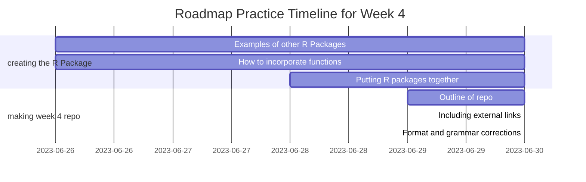

# Week 4 R Package: Making an R Package

[](https://twitter.com/csulb/with_replies)

Week 4: Making an R Package Using Week 2 Functions
1. Installation
2. Contact
3. Contributing
4. What is an R package
5. Key points of an R package
6. My R Package
7. Roadmap
8. Helpful Resources

# Installation
hsherrod2019/Week4RepoReal is available from GitHub

### Install from GitHub
To install the development version of the package, load the following code into R studio:
```
if(!require(devtools))
install.packages("devtools")

if(!require(OpenSpecy))
install.packages("OpenSpecy")

devtools::install_github("hsherrod2019/Week4RepoReal")
```

### Getting Started
Make sure to load the OpenSpecy package which contains the raman_hdpe.csv; the csv can also be found under the 'Data' tab on the repository
```
library(devtools)
library(Week4RepoReal)
library(OpenSpecy)
```

### Reference
[Here](https://github.com/wincowgerDEV/OpenSpecy-package) is the Open Specy webpage as a reference to how the functions for these R packages were created.


# Contact
If you want to connect with me, [email here](mailto:hannah@mooreplasticresearch.org)

# Contributing
Contributions of all kinds are greatly appreciated!
Contact [here](mailto:hannah@mooreplasticresearch.org) on how to get started

Remember to adhere to this project's [Code of Conduct](https://github.com/Cambalab/fake-data-generator/blob/master/.github/CODE_OF_CONDUCT.md)

# What is an R Package?
An R package is a collection of functions, data, and documentation that acts like a toolkit for users to perform tasks in R studio. They are created by developers and shared with the R community.

# Key points of an R Package
1. Functionality: Each package typically focuses on a specific area of analysis
2. Installation: Need to install an R package to use it
3. Loading a package: Need to load an R package once it is installed
4. Function usage: After loading a package, you can use its functions to perform specific tasks
5. Documentation: R packages come with documentation that explains how to use their functions and provide examples
6. Community and updates: R packages are created and maintained by a community of developers and are often updated to fix bugs, add new features, etc.

# My R Package
Created an R package incorporating three functions that I created during the Week 2 training.

### #1 Calculate Average Intensity
### #2 Calculate Intensity Ratio
### #3 Calculate Average Wavenumber

# Roadmap


# Helpful Resources
[Examples of R Packages](https://github.com/nanxstats/awesome-shiny-extensions)

[Tutorial on how to build an R Package](https://www.prestevez.com/post/r-package-tutorial/)
